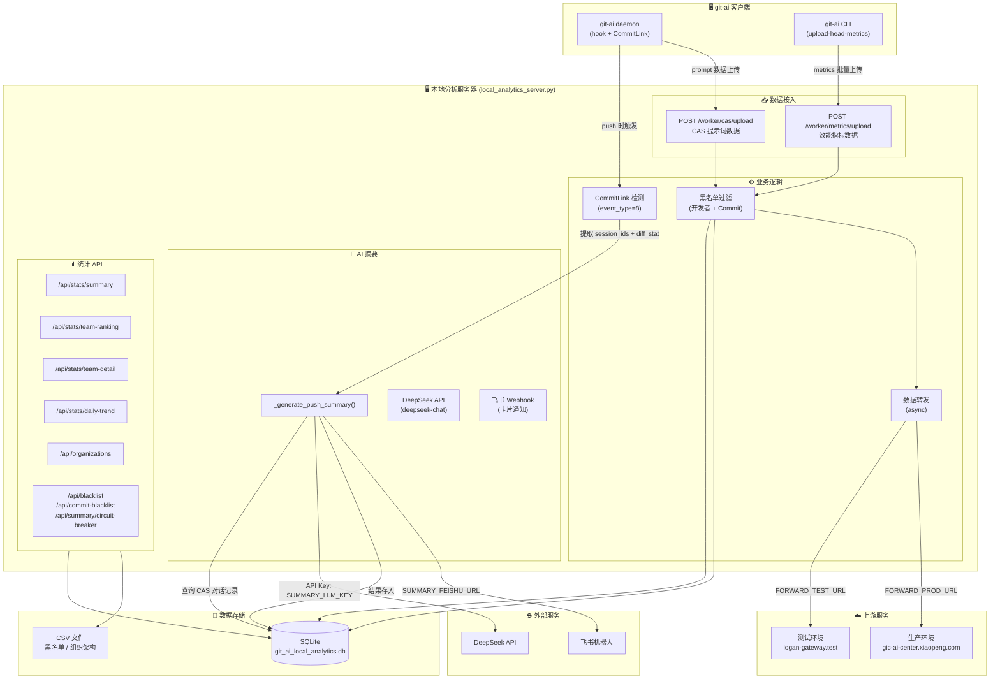
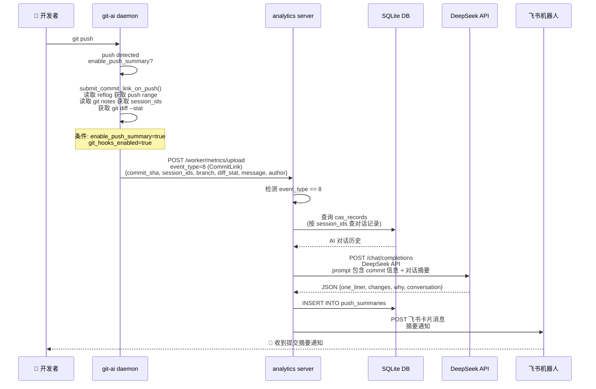

# 服务端架构

## 架构总览



## 数据流详解

### 1. Push → CommitLink → 摘要



### 2. 配置开关

CommitLink 摘要功能需要两个开关同时开启：

| 配置项 | 位置 | 默认值 | 说明 |
|--------|------|--------|------|
| `enable_push_summary` | `~/.git-ai/config.json` 顶层 | `false` | 控制是否在 push 时提交 CommitLink 事件 |
| `feature_flags.git_hooks_enabled` | `~/.git-ai/config.json` 内 | `false` | git hooks 是否启用 |

```json
{
  "enable_push_summary": true,
  "feature_flags": {
    "git_hooks_enabled": true
  }
}
```

## 数据库表结构

### metrics_events（效能事件）

| 字段 | 类型 | 说明 |
|------|------|------|
| id | INTEGER PK | 自增主键 |
| timestamp | INTEGER | Unix 时间戳 |
| event_type | INTEGER | 事件类型（1=提交, 8=CommitLink） |
| values_json | TEXT | 事件值 JSON |
| attributes_json | TEXT | 事件属性 JSON |

### cas_records（CAS 提示词数据）

| 字段 | 类型 | 说明 |
|------|------|------|
| id | INTEGER PK | 自增主键 |
| hash | TEXT UNIQUE | CAS 对象哈希 |
| metadata | TEXT | 元数据 JSON（含 session_id） |
| data | TEXT | 提示词内容 JSON |

### push_summaries（提交摘要）

| 字段 | 类型 | 说明 |
|------|------|------|
| id | INTEGER PK | 自增主键 |
| commit_sha | TEXT UNIQUE | 提交 SHA |
| branch | TEXT | 分支名 |
| session_ids | TEXT | 关联的会话 ID 列表 (JSON) |
| one_liner | TEXT | AI 生成的单句摘要 |
| conversation_summary | TEXT | 对话摘要 |
| changes_summary | TEXT | 改动摘要 |
| diff_stat | TEXT | git diff --stat 原始输出 |
| why | TEXT | 改动原因分析 |
| created_at | TIMESTAMP | 创建时间 |

## API 路由汇总

### 数据接入

| 方法 | 路径 | 说明 |
|------|------|------|
| POST | `/worker/cas/upload` | CAS 提示词批量上传 |
| GET | `/worker/cas/` | 按 hash 查询 CAS 对象 |
| POST | `/worker/metrics/upload` | 效能指标批量上传 |

### 统计查询

| 方法 | 路径 | 参数 | 说明 |
|------|------|------|------|
| GET | `/api/stats/summary` | `dept_id`, `start`, `end` | 部门统计概览 |
| GET | `/api/stats/team-ranking` | `dept_id`, `start`, `end` | 团队排名 |
| GET | `/api/stats/team-detail` | `dept_id`, `start`, `end`, `group_id?` | 团队详情 |
| GET | `/api/stats/daily-trend` | `dept_id`, `start`, `end` | 每日趋势 |
| GET | `/api/organizations` | `org_id?` | 组织架构查询 |

### 管理

| 方法 | 路径 | 说明 |
|------|------|------|
| GET/POST | `/api/blacklist` | 开发者黑名单管理 |
| DELETE | `/api/blacklist/<email_prefix>` | 移除黑名单 |
| GET/POST | `/api/commit-blacklist` | Commit 黑名单管理 |
| DELETE | `/api/commit-blacklist/<sha>` | 移除 Commit 黑名单 |
| GET/POST | `/api/summary/circuit-breaker` | LLM 摘要熔断开关 |

## 环境变量 (.env)

| 变量 | 用途 | 默认值 |
|------|------|--------|
| `FEISHU_WEBHOOK_URL` | 飞书通知 Webhook | `https://open.feishu.cn/open-apis/bot/v2/hook/...` |
| `FORWARD_TEST_URL` | 测试环境转发地址 | `http://logan-gateway.test.logan.xiaopeng.local/xp-ai-coding` |
| `FORWARD_TEST_API_KEY` | 测试环境 API Key | `xp-ai-coding-2026-api-key` |
| `FORWARD_PROD_URL` | 生产环境转发地址 | `https://gic-ai-center.xiaopeng.com` |
| `FORWARD_PROD_API_KEY` | 生产环境 API Key | `xp-ai-coding-2026-api-key` |
| `SUMMARY_LLM_KEY` | AI 摘要 LLM Key | **必填**，未设置则跳过摘要 |
| `SUMMARY_LLM_URL` | AI 摘要 LLM 地址 | `https://api.deepseek.com/v1` |
| `SUMMARY_LLM_MODEL` | AI 摘要模型 | `deepseek-chat` |
| `SUMMARY_FEISHU_URL` | 摘要飞书通知 URL | 可选，未设置则跳过飞书推送 |

## 部署运行

服务器脚本位置：`Y:\acsp\local_analytics_server.py`

配置文件：`Y:\acsp\agent_service\.env`

日志文件：`Y:\acsp\server.log`

数据库文件：`Y:\acsp\git_ai_local_analytics.db`
